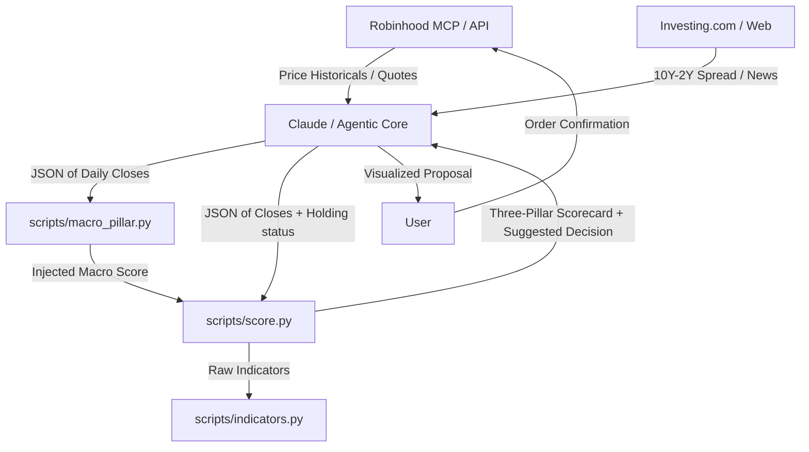

# Agentic Trading Desk

Personal trading desk for technical analysis and short-term portfolio management on stocks and ETFs. The system combines the automation and query capabilities of an Artificial Intelligence agent (via Robinhood MCP protocol) with local deterministic mathematical calculation engines in Python.

The ruling principle is: **the AI fetches data, computes deterministic indicators, and — on the Agentic (cash) account — decides and executes trades autonomously; the deterministic `risk_guard.py` gate bounds every order before it is placed.**

> ⚠️ **Autonomous trading — real money, real risk.** This configuration lets the agent place live Robinhood orders on the Agentic account **without asking you to confirm each trade**. Losses can be rapid and are irreversible. Autonomy is bounded by the deterministic risk gate (position/size caps, daily-trade budget, settled-cash/T+1 rules, protected positions) and a master kill switch (`config.enabled=false` in `risk_guard.py`). Set conservative limits, keep the kill switch handy, and review the audit log regularly. The Individual (margin) account is never auto-traded.

---

## 🚀 Project Architecture

The project is designed to operate locally and modularly. All technical indicator computations are delegated to Python 3 scripts that only use the Python standard library (`stdlib`), ensuring speed and zero network dependencies during execution.



### File Structure
*   **[SKILL.md](SKILL.md)**: Operations manual and specific guardrails guiding the AI agent's actions.
*   **[scripts/indicators.py](scripts/indicators.py)**: Mathematical engine to calculate technical indicators without visual estimations.
*   **[scripts/macro_pillar.py](scripts/macro_pillar.py)**: Macro regime detector and cross-asset sentiment scorer.
*   **[scripts/score.py](scripts/score.py)**: Evaluator of the three-pillar framework and exit/entry decision engine.

---

## 📈 The Three-Pillar Framework

Each analyzed asset is scored in three independent categories with scores from **-2 to +2** (for a consolidated total range of **-6 to +6**):

### 1. Trend
Determined in [scripts/score.py](scripts/score.py#L30) using:
*   Price position relative to the **EMA 20**.
*   Structural crossovers between exponential moving averages: **EMA 20 > EMA 50** and **EMA 50 > EMA 200**.
*   Slope direction of the **EMA 200** (measured relative to 5 bars ago).

### 2. Momentum
Determined in [scripts/score.py](scripts/score.py#L58) combining:
*   **RSI-14** using **Wilder's** smoothing (neutral zone from 45 to 55).
*   Sign of the **MACD (12, 26, 9)** histogram.
*   **TRIX-15** (triple EMA rate of change) compared against its EMA-9 signal line.

**Bollinger Bands** (20/2, population σ) are also computed and used as a supporting exhaustion signal (`%B ≥ 1` flags price at/above the upper band) but do not feed into the numeric momentum score.

### 3. Macro-Sentiment (Macro Environment)
Calculated by the [scripts/macro_pillar.py](scripts/macro_pillar.py) cross-asset analysis script, which weights the following components:
*   **Market Concentration**: RSP/SPY (equal-weight vs. cap-weight S&P 500).
*   **Yield Curve**: 10Y-2Y treasury yield spread (injected from Investing.com).
*   **Corporate Credit**: HYG/LQD ratio (high-yield vs. investment-grade).
*   **Size Factor**: IWM/SPY ratio (small caps vs. large caps).
*   **Asset Preference**: SPY/TLT ratio (equities vs. bonds).
*   **Sector Rotation**: XLY/XLP ratio (cyclical vs. defensive sectors).
*   **Inflationary Correlation**: Rolling SPY-TLT correlation.

---

## 🛠️ Script Usage

The scripts are run via the command line consuming data in JSON format.

### 1. Raw Indicators Computation
To obtain the detailed breakdown of all calculated indicators for an asset:
```bash
python3 scripts/indicators.py input_ticker.json
```
*Expected format for `input_ticker.json`:*
```json
{
  "close": [100.5, 101.2, 102.0, 101.8, 103.1, ...]
}
```

### 2. Macro-Sentiment Scoring
To calculate the regime and macro pillar of the session:
```bash
python3 scripts/macro_pillar.py macro_input.json --json
```
*Expected format for `macro_input.json`:*
```json
{
  "as_of": "2026-07-02",
  "yield_spread": -0.15,
  "series": {
    "SPY": [450.1, 452.3, ...],
    "RSP": [152.0, 151.8, ...],
    "IWM": [198.5, ...],
    "HYG": [...],
    "LQD": [...],
    "TLT": [...],
    "XLY": [...],
    "XLP": [...]
  }
}
```

### 3. Ticker Scoring and Decision
To obtain the complete three-pillar scorecard and action suggestion for the Agentic account:
```bash
python3 scripts/score.py ticker_input.json        # human-readable table
python3 scripts/score.py ticker_input.json --json  # machine-readable output
python3 scripts/score.py                           # self-test with synthetic data
```
*Expected format for `ticker_input.json`:*
```json
{
  "symbol": "AAPL",
  "close": [220.5, 222.1, 221.8, ...],
  "macro_score": 1,
  "holding": true
}
```

The output includes the three-pillar scorecard, active flags (exhaustion / bearish / rebound / death-cross), and one of the following decisions:

| Decision | Context |
|---|---|
| `EXIT / TRIM` | Holding — bullish momentum exhausted |
| `EXIT` | Holding — bearish momentum relentless |
| `RE-ENTRY (new cycle)` | Flat — rebound with healthy EMA structure |
| `TACTICAL REBOUND (counter-trend)` | Flat — rebound inside a death-cross (reduced size, tight stop) |
| `HOLD (ride the cycle)` | Holding — trend and momentum positive |
| `HOLD (under review)` | Holding — weak signals, no full exit trigger yet |
| `WAIT (do not chase)` | Flat — healthy trend but no fresh entry trigger |
| `STAY OUT / AVOID` | Flat — relentless bearish, no rebound |
| `HOLD / OBSERVE` or `OBSERVE` | Mixed signals — no action, watch next close |

Before selecting a decision, the script detects **flags** — specific indicator patterns that signal exhaustion (e.g., RSI turning from overbought, MACD histogram shrinking), bearish persistence, or rebound triggers. The decision cascade prioritizes exit triggers for holders and entry triggers for flat positions. When `macro_score ≤ -1`, the framing is adjusted (tighter targets, reduced size) but the numeric pillar scores remain unchanged.

---

## 🤖 Claude Code Integration

To use this project as a **Skill** with Claude Code for automated trading analysis:

### 1. Add the Skill
Place the `SKILL.md` file in your Claude Code skills directory (typically `~/.claude/code/skills/`):
```bash
# Clone or copy this repository to your skills folder
cp -r /path/to/agentic-trading-desk ~/.claude/code/skills/agentic-trading-desk
```

Or reference it directly from this repository.

### 2. Agent Operation
Once loaded, Claude Code will:
* Automatically use this skill when you ask to analyze tickers, review positions, or make trading decisions
* Fetch data via Robinhood MCP protocol
* Call the Python scripts (`scripts/indicators.py`, `scripts/score.py`, `scripts/macro_pillar.py`) for deterministic calculations
* Present the three-pillar scorecard with actionable decisions
* Gate every order through `scripts/risk_guard.py` and **execute autonomously on the Agentic account** (bounded by the risk gate and kill switch)

### 3. Example Workflow
```
You: "Analyze AAPL for a potential entry"

1. Data Fetching (Robinhood MCP)
   → Fetches AAPL daily historicals (~290 bars for EMA 200)
   → Fetches live quote (current price / last close)
   → Checks if there is an open position → sets holding = true/false

2. Macro Pillar (once per session, shared across all tickers)
   → Fetches historicals for 7 ETFs: SPY, RSP, IWM, HYG, LQD, TLT, XLY, XLP
   → Retrieves 10Y-2Y yield spread from Investing.com
   → Runs: python3 scripts/macro_pillar.py → macro_score (-2 to +2)

3. Ticker Scoring
   → Assembles JSON with {symbol, close, macro_score, holding}
   → Runs: python3 scripts/score.py → three-pillar scorecard + decision
     (score.py calls indicators.py internally for all calculations)

4. Qualitative Context (reinforcement, does not alter scores)
   → News and macro context from Investing.com
   → Analyst consensus and price targets from Google Finance

5. Autonomous Execution (Agentic account)
   → Returns: Scorecard, flags, and action (RE-ENTRY, HOLD, EXIT, etc.)
   → If the action implies an order: build proposal → risk_guard.py → if APPROVE,
     review_*_order → place_*_order at the approved size (no confirmation prompt)
   → Every action is logged for your audit
```

The agent operates under the principle: **AI fetches data and computes deterministic indicators; the deterministic risk gate bounds each order; the agent decides and executes autonomously on the Agentic account (with a kill switch and audit log).**

---

## 📰 External Qualitative Context (Reinforcement)

To complement the purely technical nature of the deterministic scripts, the AI agent integrates a real-time **qualitative reinforcement analysis** before presenting the final recommendation:

1.  **News and Macro**: Dynamically retrieved from **Investing.com** (validated source to avoid prompt injection risks).
2.  **Analyst Consensus and Reports**: Queries **Google Finance Beta** (`https://www.google.com/finance/beta/quote/<TICKER>:<EXCHANGE>?tab=analysis`) to extract:
    *   Overall consensus (*Buy/Hold/Sell*).
    *   12-month price targets (average, maximum, minimum) contrasted against the current price of the ticker.
    *   Recent earnings results (actual vs. estimated).
    *   Recent analyst rating changes (< 2 weeks).

*Note: This information is presented to the user alongside the three-pillar scorecard as interpretive context; **it does not directly alter** the mathematical score returned by the scripts, ensuring that quantitative triggers and risk management remain 100% deterministic.*

---

## 🛡️ Guardrails and Operation (Non-Negotiable)

In autonomous mode the deterministic gate — not a human prompt — enforces these limits. See [scripts/risk_guard.py](scripts/risk_guard.py).

1.  **Special Position Protection**: Certain positions can be designated as *protected* (e.g., restricted stock grants) via `risk_guard.py`'s `config.protected`. The gate hard-rejects any sell/trim of them.
2.  **Account Segregation**:
    *   **Agentic** (Cash Account): Oriented toward fast returns and capital rotation via tactical trades and defined cycles. **This is the only account traded autonomously.**
    *   **Individual** (Margin Account): Core passive long-term investing — never auto-traded.
3.  **T+1 Liquidity**: In the cash account, only settled capital funds buy orders. Enforced by `risk_guard.py` (`require_settled_cash`, `min_cash_reserve`).
4.  **Deterministic Risk Gate + Kill Switch**: Every order is first passed to `risk_guard.py`, which returns `APPROVE`/`REJECT` and clamps the size to hard limits (`max_position_pct`, `max_trade_pct`, `max_daily_trades`). The agent still runs `review_*_order` (simulation) before `place_*_order`, and places at most the approved size. Setting `config.enabled=false` is a master kill switch that rejects all orders.

### Risk gate usage
```bash
python3 scripts/risk_guard.py order.json --json   # exit 0 = APPROVE, 2 = REJECT
python3 scripts/risk_guard.py                      # self-test with built-in scenarios
```
`order.json` = `{proposal:{symbol,side,price,quantity|notional}, account:{portfolio_value,settled_cash,positions}, config:{...limits...}}`. The agent may only place `approved.quantity` shares (never more), and only when `decision == "APPROVE"`.
